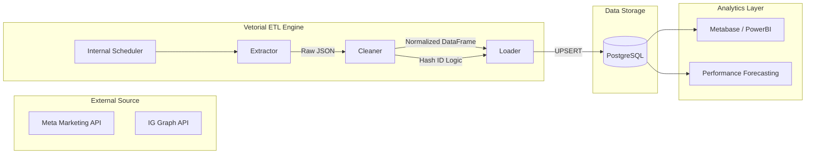

# Vetorial ETL – Meta Marketing Data Pipeline

A robust, production-grade ETL pipeline designed to ingest, normalize, and consolidate marketing performance data from the **Meta Marketing API** (Facebook & Instagram Ads) and the **Instagram Graph API**. This pipeline transforms raw API responses into high-fidelity analytics-ready tables in **PostgreSQL**.

---

## 1. Project Overview
In the modern digital laboratory, marketing data is the primary fuel for decision-making. However, extracting this data is notoriously difficult due to the volatile nature of social media APIs. This project serves as a reliable bridge between Meta’s complex nested JSON structures and a structured SQL environment, ensuring that marketing teams have access to a "Single Source of Truth."

## 2. Business Problem
Marketing agencies and data teams face significant hurdles when manually exporting or scripting Meta data:

*   **Delayed Attribution:** Conversions (leads/sales) often happen days after the initial click. Standard daily extracts miss these updates.
*   **Inconsistent API Responses:** The Meta API omits keys for metrics with zero values (e.g., if an ad had 0 clicks, the `clicks` key is missing entirely), causing schema breakages in naive scripts.
*   **Action Type Complexity:** Conversions are buried inside a generic `actions` array, making it hard to distinguish between a "WhatsApp Message" and a "Website Lead."
*   **Follower Tracking:** Associating follower growth specifically with paid acquisition vs. organic trends is difficult without granular breakdown data.

## 3. Solution
The Vetorial ETL pipeline addresses these pain points by:
*   Implementing a **rolling extraction window** to capture attribution updates.
*   A **Strict Schema Filter** that provides default zero values for missing API keys.
*   A **Hierarchical Action Parser** that unifies diverse conversion signals into logical business metrics.
*   **Granular Breakdowns** (Platform + Position) to identify which placements drive the best ROI.

## 4. Architecture
The system follows a modular ETL pattern, containerized with Docker for seamless deployment in Cloud or On-Premise environments.

## 5. Data Model
The pipeline populates the `insights_meta_ads` table, designed for high-performance analytical queries.

| Column | Type | Description |
| :--- | :--- | :--- |
| `hash_id` | `VARCHAR(32)` | **Primary Key.** MD5 hash for idempotency. |
| `id_anuncio` | `BIGINT` | Meta Ad ID. |
| `data_registro` | `DATE` | The date the performance occurred. |
| `spend` | `NUMERIC` | Amount spent in account currency. |
| `leads_total` | `INTEGER` | Unified sum of Form, Site, and Message leads. |
| `seguidores` | `INTEGER` | Instagram followers attributed to the ad. |
| `plataforma` | `VARCHAR` | Facebook, Instagram, Messenger, or Audience Network. |
| `posicionamento`| `VARCHAR` | Feed, Stories, Reels, etc. |

## 6. ETL Design Decisions

### 🔄 30-Day Rolling Window
To solve the **Delayed Attribution** problem, the pipeline re-fetches the last 30 days of data in every cycle. This ensures that if a user clicks an ad today but converts 7 days later, the conversion is correctly backfilled.

### 🛡️ Idempotent Loads & UPSERT
We use a **Load-or-Update** strategy. Instead of simple inserts, the pipeline utilizes a `hash_id` (generated from `ad_id` + `date` + `platform` + `position`). If a record with that hash already exists, the database updates the metrics; otherwise, it creates a new entry.

### 🧩 Schema Safety Filter
The `PostgresLoader` module maintains a `REQUIRED_COLUMNS` whitelist. This prevents "field bleed" (where Meta adds a new API field that doesn't exist in our DB) from crashing the pipeline, while highlighting missing essential fields via logs.

## 7. Scalability
The pipeline is built for **Multi-Tenancy**. By configuring the `META_AD_ACCOUNT_IDS` environment variable as a comma-separated list, the engine iterates through dozens of accounts sequentially, maintaining isolation and error handling for each.

## 8. Example Analytics Use Cases
With this structured data, organizations can answer:
*   **Blended CPL:** "What is my true Cost Per Lead across Form + WhatsApp?"
*   **Creative Fatigue:** "At what frequency does my CTR start to drop significantly?"
*   **Placement Efficiency:** "Is Instagram Reels more cost-effective for followers than the Feed?"
*   **Attribution Drift:** "How many leads are credited to ads 7+ days after the click?"

## 9. Lessons Learned (Meta API Quirks)
*   **Field Fragmentation:** Some metrics like `link_clicks` appear both as root fields and inside the `actions` array. We prioritize the sum of both for maximum accuracy.
*   **Rate Limiting:** Sequential processing with small sleep intervals (2s) is more reliable than aggressive parallel threading, which often triggers Meta's app-level rate limits.
*   **Timezone Alignment:** Always force `TZ=America/Sao_Paulo` (or your local TZ) in Docker to avoid "shifted day" metrics where clicks at 11:59 PM land on the wrong date.

## 10. Infrastructure
*   **Language:** Python 3.10 (Optimized with Pandas/SQLAlchemy).
*   **Containerization:** Docker & Docker Compose (Production ready for Portainer/Swarm).
*   **Database:** PostgreSQL 14+ (Supports JSONB for raw data auditing).
*   **Monitoring:** Integrated Discord Webhooks for real-time failure alerts.

## 11. Future Improvements
*   **Orchestration:** Migration to **Apache Airflow** for complex dependency management.
*   **Transformation:** Implementing **dbt (data build tool)** for T-layer modeling and documentation.
*   **Expansion:** Integrating Google Ads and TikTok Ads APIs to create a unified cross-channel dashboard.

---
*Maintained by the Data Engineering Team @ Covil Labs*
